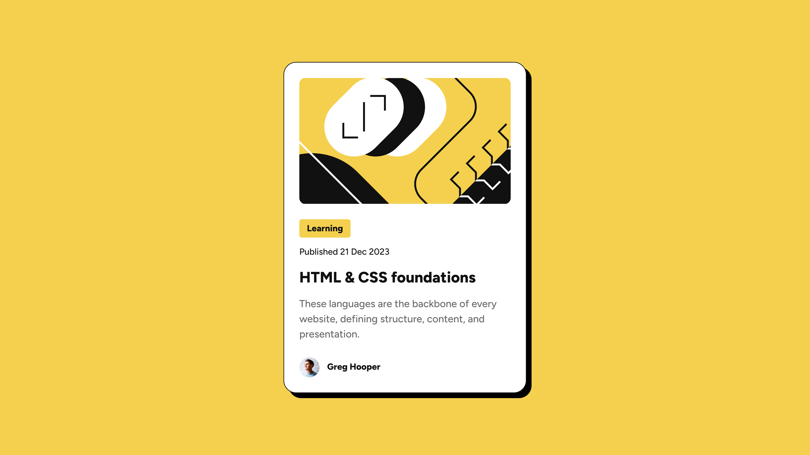

# Frontend Mentor - Blog preview card solution

This is a solution to the [Blog preview card challenge on Frontend Mentor](https://www.frontendmentor.io/challenges/blog-preview-card-ckPaj01IcS). Frontend Mentor challenges help you improve your coding skills by building realistic projects.

## Table of contents

- [Overview](#overview)
  - [The challenge](#the-challenge)
  - [Screenshot](#screenshot)
  - [Links](#links)
- [My process](#my-process)
  - [Built with](#built-with)
- [Author](#author)

## Overview

### The challenge

Users should be able to:

- See hover and focus states for all interactive elements on the page

### Screenshot

### Links

- Solution URL: [Add solution URL here](https://your-solution-url.com)

## My process

### Built with

- Semantic HTML5 markup
- Flexbox
- CSS Grid and Flexbox
- Mobile-first workflow
- Vite
- Tailwind CSS

## Author

- Website - [saraholiveira.vercel.app](https://www.saraholiveira.vercel.app)
- Linkedin - [/soliveira](https://www.linkedin.com/in/soliveirarm)
- Frontend Mentor - [@soliveirarm](https://www.frontendmentor.io/profile/soliveirarm)
